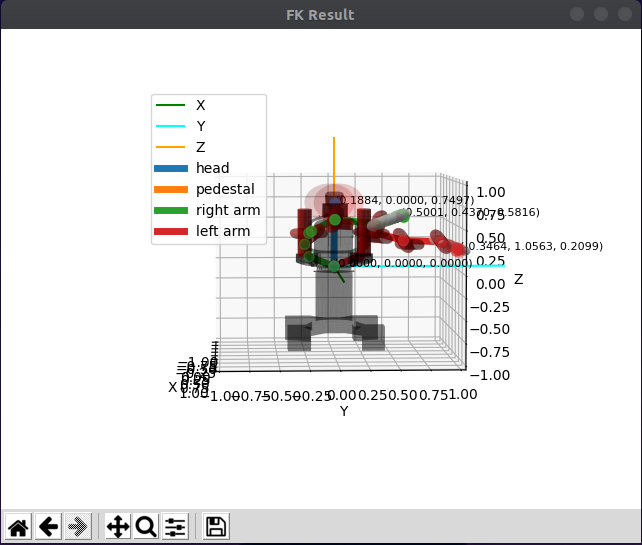
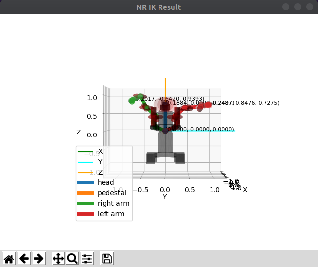
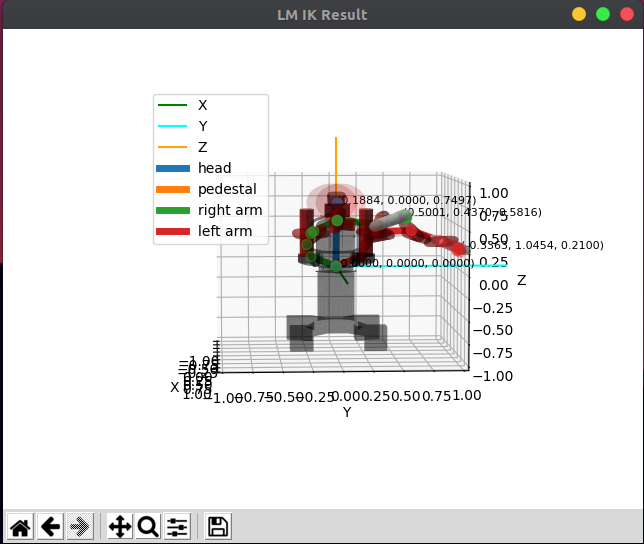

#  pykin
  

Python Interface for the Robot Kinematics Library

This library has been created simply by referring to [ikpy](https://github.com/Phylliade/ikpy.git).

## Features

- Pure python library
- Support only URDF file
- Compute Forward, Inverse Kinematics and Jacobian
- There are two ways to find the IK solution, referring to the [Introduction to Humanoid Robotics book](https://link.springer.com/book/10.1007/978-3-642-54536-8).
- Compute Collision checkinkg
- Plot Robot Kinematic Chain and Robot Mesh (STL file)

## Installation

### Requirements

You need a [python-fcl](https://github.com/BerkeleyAutomation/python-fcl) package to do object collision checking.

- For Ubuntu, using  `apt`

  `sudo apt install liboctomap-dev`

  `sudo apt install libfcl-dev`

- For Mac, First, Download the source and build it.

  - octomap

    `git clone https://github.com/OctoMap/octomap.git`

    ~~~
    $ cd octomap
    $ mkdir build
    $ cd build
    $ cmake ..
    $ make
    $ make install
    ~~~

  - fcl

    `git clone https://github.com/flexible-collision-library/fcl.git`

    Since python-fcl uses version 0.5.0 of fcl, checkout with tag 0.5.0

    ~~~
    $ cd fcl
    $ git checkout 0.5.0
    $ mkdir build
    $ cd build
    $ cmake ..
    $ make
    $ make install
    ~~~

If the above installation is complete

~~~
pip install python-fcl
~~~

### Install Pykin

~~~
pip install pykin
~~~

When git clone, use the --recurse-submodules option. 

The download may take a long time due to the large urdf file size.

~~~
git clone --recurse-submodules https://github.com/jdj2261/pykin.git
~~~

## Quick Start

- Robot Info

  You can see 4 example robot information.

   `baxter, iiwa14, panda, and sawyer`

  ~~~python
  import sys
  from pykin.robot import Robot
  
  file_path = '../asset/urdf/baxter/baxter.urdf'
  if len(sys.argv) > 1:
      robot_name = sys.argv[1]
      file_path = '../asset/urdf/' + robot_name + '/' + robot_name + '.urdf'
      
  robot = Robot(file_path)
  robot.show_robot_info()
  ~~~

  `python robot_info.py baxter`

- Forward Kinematics

  ~~~python
  from pykin.robot import Robot
  from pykin.kinematics.transform import Transform
  from pykin.utils.shell_color import ShellColors as sc
  
  # baxter_example
  file_path = '../asset/urdf/baxter/baxter.urdf'
  robot = Robot(file_path, Transform(rot=[0.0, 0.0, 0.0], pos=[0, 0, 0]))
  
  # set input joints 
  head_thetas = [0.0]
  right_arm_thetas = [0, 0, 0, 0, 0, 0, 0]
  left_arm_thetas = [0, 0, 0, 0, 0, 0, 0]
  thetas = head_thetas + right_arm_thetas + left_arm_thetas
  
  # compute FK
  fk = robot.forward_kinematics(thetas)
  for link, transform in fk.items():
      print(f"{sc.HEADER}{link}{sc.ENDC}, {transform.rot}, {transform.pos}")
  ~~~
  
- Inverse Kinematics

  ~~~python
  import numpy as np
  from pykin.robot import Robot
  from pykin.kinematics.transform import Transform
  
  # baxter_example
  file_path = '../asset/urdf/baxter/baxter.urdf'
  robot = Robot(file_path, Transform(rot=[0.0, 0.0, 0.0], pos=[0, 0, 0]))
  
  # set joints for targe pose
  right_arm_thetas = np.random.randn(7)
  
  # set init joints
  init_right_thetas = np.random.randn(7)
  
  # Before compute IK, you must set desired root and end link
  robot.set_desired_frame("base", "right_wrist")
  
  # Compute FK for target pose
  target_fk = robot.kin.forward_kinematics(right_arm_thetas)
  
  # get target pose
  target_r_pose = np.hstack((target_fk["right_wrist"].pos, target_fk["right_wrist"].rot))
  
  # Compute IK Solution using LM(Levenberg-Marquardt) or NR(Newton-Raphson) method
  ik_right_result, _ = robot.kin.inverse_kinematics(init_right_thetas, target_r_pose, method="LM")
  
  # Compare error btween Target pose and IK pose
  result_fk = robot.kin.forward_kinematics(ik_right_result)
  error = robot.compute_pose_error(
      target_fk["right_wrist"].matrix(),
      result_fk["right_wrist"].matrix())
  print(error)
  ~~~

## Inverse Kinematics 

You can see an example of IK by running the command below.

~~~shell
$ cd pykin/example
$ python robot_ik_baxter_test.py
~~~

- **Forward Kinematics**

  

- **IK Newton Raphson method**

  

- **IK Levenberg-Marquardt method**

  

**It can be seen that the LM method is faster and more accurate than the NR method when using IK.**

