# pykin

  

Python Interface for the Robot Kinematics Library pykin

This library has been created simply by referring to <a href="https://github.com/Phylliade/ikpy.git" target="_blank">ikpy</a>

You can see a Pick and Place demo video using pykin library <a href="https://youtu.be/p9TlIp-xxbs" target="_blank">here</a> in Mujoco 

## Features

- Pure python library
- Support only URDF file
- Compute forward, inverse kinematics and jacobian, referred to the [Introduction to Humanoid Robotics book](https://link.springer.com/book/10.1007/978-3-642-54536-8).
- Check robot self-collision and collision between objects
- Plot robot kinematic chain and mesh

## Installation

### Requirements

You need a [python-fcl](https://github.com/BerkeleyAutomation/python-fcl) package to do object collision checking.

- For Ubuntu, using  `apt`

  `sudo apt install liboctomap-dev`

  `sudo apt install libfcl-dev`
- For Mac, First, Download the source and build it.

  - octomap

    `git clone https://github.com/OctoMap/octomap.git`

    ~~~
    $ cd octomap
    $ mkdir build
    $ cd build
    $ cmake ..
    $ sudo make
    $ sudo make install
    ~~~
  - fcl

    `git clone https://github.com/flexible-collision-library/fcl.git`

    Since python-fcl uses version 0.5.0 of fcl, checkout with tag 0.5.0

    ~~~
    $ cd fcl
    $ git checkout 0.5.0
    $ mkdir build
    $ cd build
    $ cmake ..
    $ sudo make
    $ sudo make install
    ~~~

### Install Pykin

~~~
pip install pykin
~~~

## Quick Start

You can see various examples in example directory

- Robot Info

  You can see 7 robot info.

  `baxter, sawyer, iiwa14, iiwa7, panda, ur5e, doosan`

  ~~~shell
  $ cd example
  $ python robot_info.py $(robot_name)
  # baxter
  $ python robot_info.py baxter
  # saywer
  $ python robot_info.py sawyer
  ~~~

- Forward kinematics

  You can compute the forward kinematics as well as visualize the visual or collision geometry.

  ~~~shell
  $ cd example/forward_kinematics
  $ python robot_fk_baxter_test.py
  ~~~

  |                            visual                            |                          collision                           |
  | :----------------------------------------------------------: | :----------------------------------------------------------: |
  | 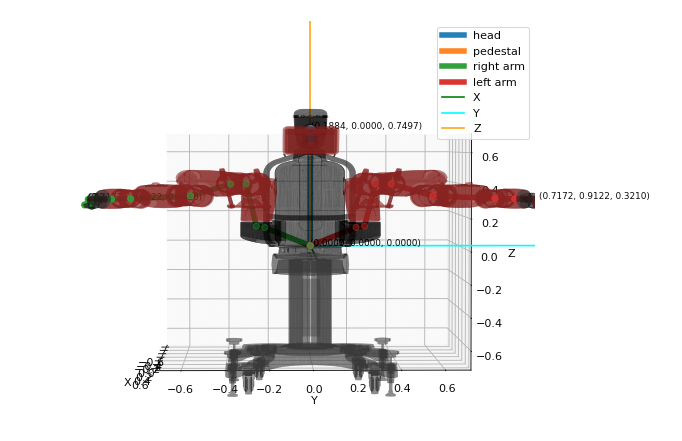 | 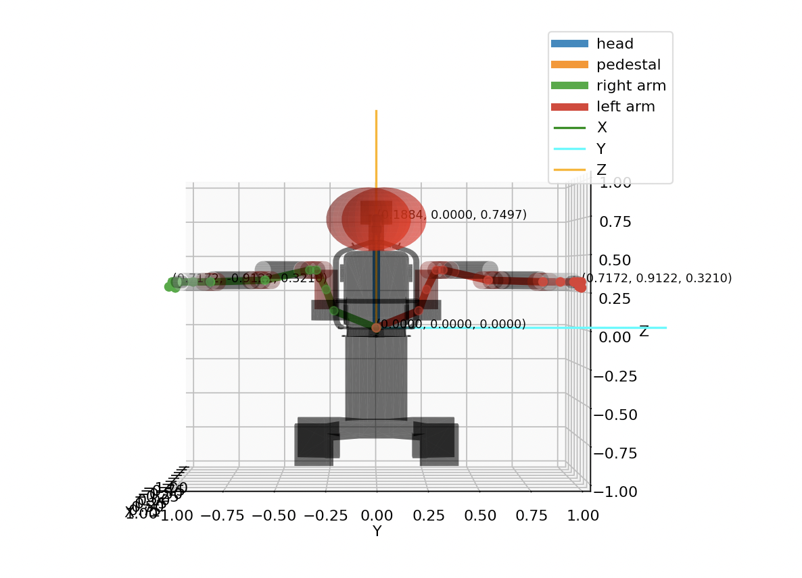 |

- Inverse Kinematics

  You can compute the inverse kinematics using levenberg marquardt(LM) or newton raphson(NR) method

  ~~~shell
  $ cd example/inverse_kinematics
  $ python robot_ik_baxter_test.py
  ~~~

- Sampling based Inverse Kinematics

  You can compute the inverse kinematics using geometric-aware bayesian optimization(GaBO) method
  
  For more detailed information, check [GaBO module](/pykin/utils/gabo/)
  
  ~~~shell
  $ cd example/inverse_kinematics
  $ python robot_ik_gabo_test.py
  ~~~

- Collision check

  The image below shows the collision result as well as visualize robot using trimesh.Scene class

  ~~~shell
  $ cd example/trimesh_renders
  $ python sawyer_render.py
  ~~~

  |                        trimesh.Scene                         |                            Result                            |
  | :----------------------------------------------------------: | :----------------------------------------------------------: |
  |  |  |

## Visualization

You can see visualization using matplotlib library or trimesh.Scene class.

- Visualize `simple urdf` using `matplotlib`

  |                        ur5e                        |                        sawyer                        |                        iiwa14                        |                        panda                        |
  | :------------------------------------------------: | :--------------------------------------------------: | :--------------------------------------------------: | :-------------------------------------------------: |
  | 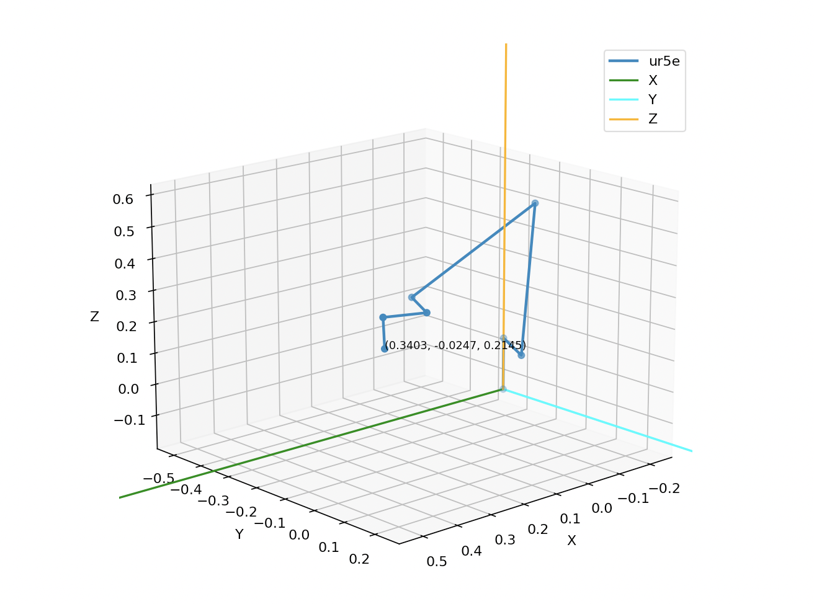 |  |  |  |

- Visualize `visual geometry` using `matplotlib`

  |                           ur5e                            |                           sawyer                            |                           iiwa14                            |                           panda                            |
  | :-------------------------------------------------------: | :---------------------------------------------------------: | :---------------------------------------------------------: | :--------------------------------------------------------: |
  | 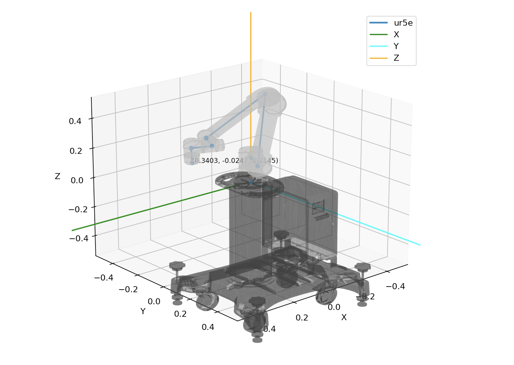 | 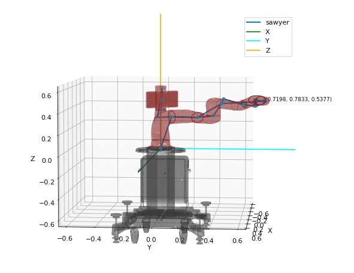 | 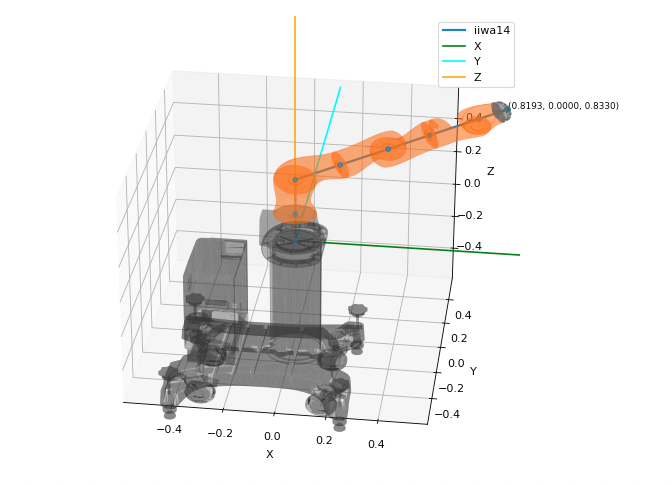 | 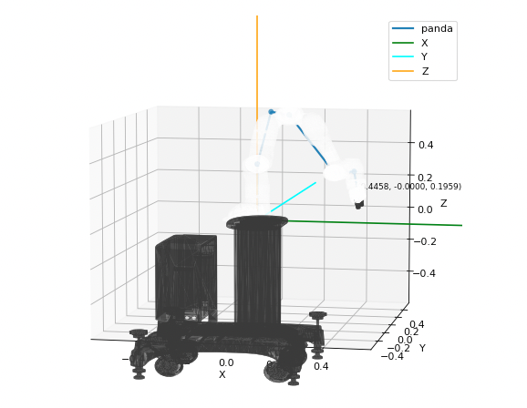 |

- Visualize `collision geometry` using `matplotlib`

  |                             ur5e                             |                            sawyer                            |                            iiwa14                            |                            panda                             |
  | :----------------------------------------------------------: | :----------------------------------------------------------: | :----------------------------------------------------------: | :----------------------------------------------------------: |
  | 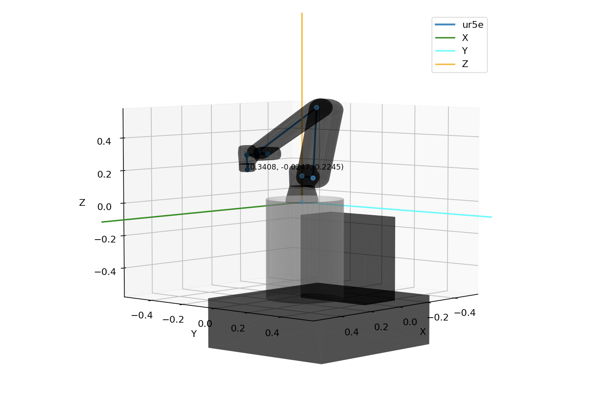 |  | 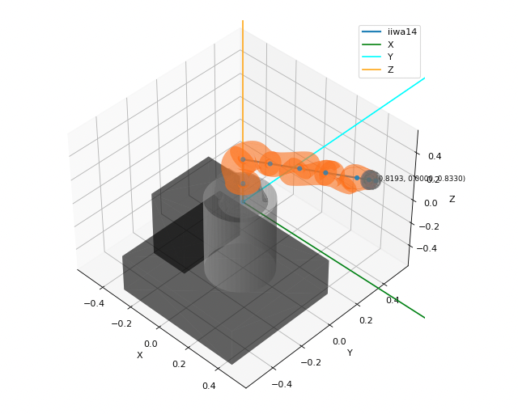 | 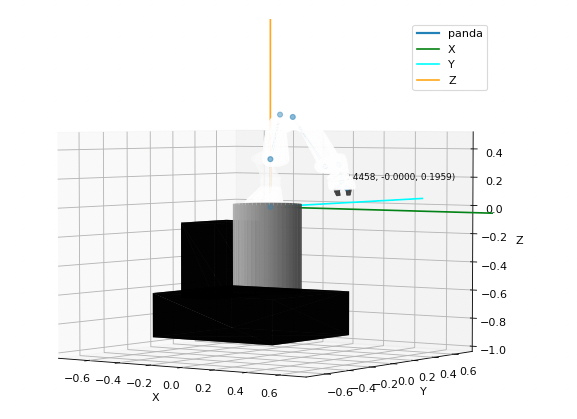 |

- Visualize mesh about `visual/collision geometry` using `trimesh.Scene class`

  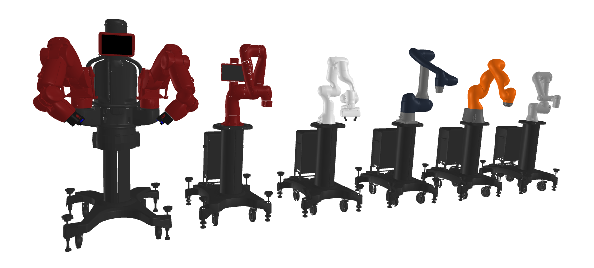
