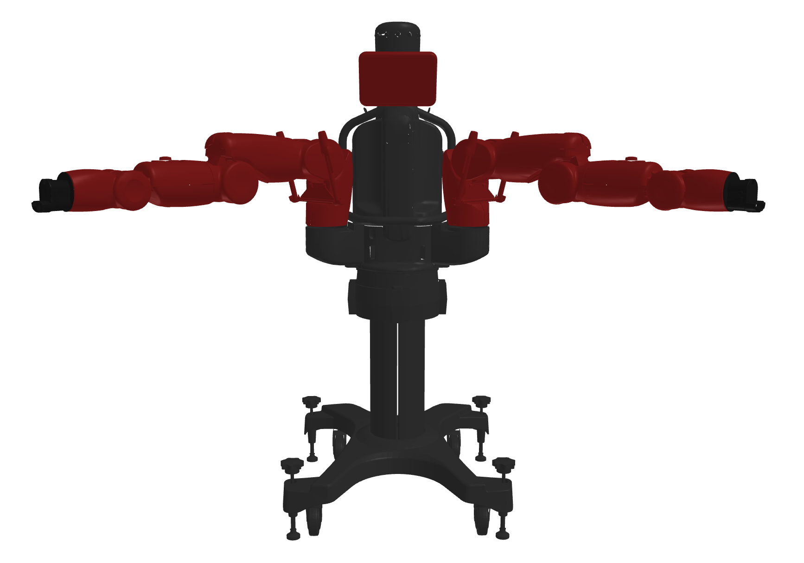
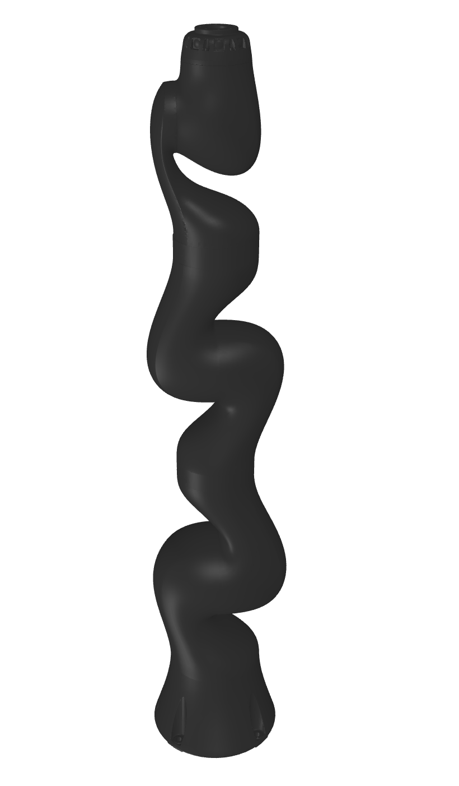
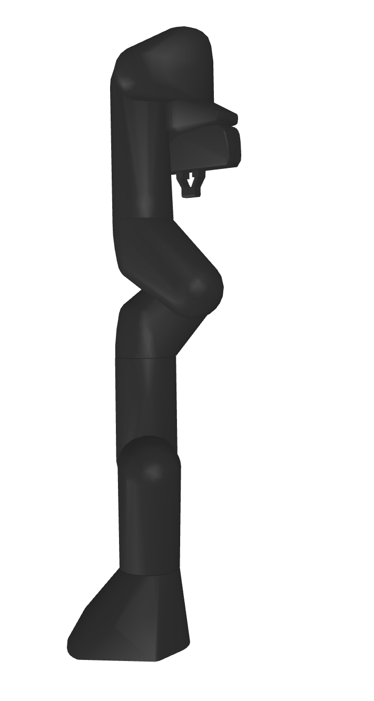

#  pykin
  

Python Interface for the Robot Kinematics Library

This library has been created simply by referring to [ikpy](https://github.com/Phylliade/ikpy.git).

## Features

- Pure python library
- Support only URDF file
- Compute Forward, Inverse Kinematics and Jacobian
- There are two ways to find the IK solution, referring to the [Introduction to Humanoid Robotics book](https://link.springer.com/book/10.1007/978-3-642-54536-8).
- Compute Collision checkinkg
- Plot Robot Kinematic Chain and Robot Mesh (STL file)

## Installation

### Requirements

You need a [python-fcl](https://github.com/BerkeleyAutomation/python-fcl) package to do object collision checking.

- For Ubuntu, using  `apt`

  `sudo apt install liboctomap-dev`

  `sudo apt install libfcl-dev`

- For Mac, First, Download the source and build it.

  - octomap

    `git clone https://github.com/OctoMap/octomap.git`

    ~~~
    $ cd octomap
    $ mkdir build
    $ cd build
    $ cmake ..
    $ make
    $ make install
    ~~~

  - fcl

    `git clone https://github.com/flexible-collision-library/fcl.git`

    Since python-fcl uses version 0.5.0 of fcl, checkout with tag 0.5.0

    ~~~
    $ cd fcl
    $ git checkout 0.5.0
    $ mkdir build
    $ cd build
    $ cmake ..
    $ make
    $ make install
    ~~~

If the above installation is complete

~~~
pip install python-fcl
~~~

### Install Pykin

~~~
pip install pykin
~~~

When git clone, use the --recurse-submodules option. 

The download may take a long time due to the large urdf file size.

~~~
git clone --recurse-submodules https://github.com/jdj2261/pykin.git
~~~

## Quick Start

- Robot Info

  You can see 4 example robot information.

   `baxter, iiwa14, panda, and sawyer`

  

    
Code
 

  ~~~python
  import sys
  from pykin.robot import Robot
  
  file_path = '../asset/urdf/baxter/baxter.urdf'
  if len(sys.argv) > 1:
      robot_name = sys.argv[1]
      file_path = '../asset/urdf/' + robot_name + '/' + robot_name + '.urdf'
      
  robot = Robot(file_path)
  robot.show_robot_info()
  ~~~

  

- Forward Kinematics

  

    
Code
 
  
  ~~~python
  from pykin.robot import Robot
  from pykin.kinematics.transform import Transform
  from pykin.utils.kin_utils import ShellColors as sc
  
  # baxter_example
  file_path = '../asset/urdf/baxter/baxter.urdf'
  robot = Robot(file_path, Transform(rot=[0.0, 0.0, 0.0], pos=[0, 0, 0]))
  
  # set input joints 
  head_thetas = [0.0]
  right_arm_thetas = [0, 0, 0, 0, 0, 0, 0]
  left_arm_thetas = [0, 0, 0, 0, 0, 0, 0]
  thetas = head_thetas + right_arm_thetas + left_arm_thetas
  
  # compute FK
  fk = robot.kin.forward_kinematics(thetas)
  for link, transform in fk.items():
      print(f"{sc.HEADER}{link}{sc.ENDC}, {transform.rot}, {transform.pos}")
  ~~~
  
  

  
- Jacobian

  

    
Code
 
  
  ~~~python
  from pykin.kinematics import transform as tf
  from pykin.robot import Robot
  
  # import jacobian
  from pykin.kinematics import jacobian as jac
  
  file_path = '../asset/urdf/baxter/baxter.urdf'
  robot = Robot(file_path, tf.Transform(rot=[0.0, 0.0, 0.0], pos=[0, 0, 0]))
  
  left_arm_thetas = [0, 0, 0, 0, 0, 0, 0]
  
  # Before compute Jacobian, you must set from start link to end link
  robot.set_desired_frame("base", "left_wrist")
  fk = robot.kin.forward_kinematics(left_arm_thetas)
  
  # If you want to get Jacobian, use calc_jacobian function
  J = jac.calc_jacobian(robot.desired_frames, fk, left_arm_thetas)
  print(J)
  
  right_arm_thetas = [0, 0, 0, 0, 0, 0, 0]
  robot.set_desired_frame("base", "right_wrist")
  fk = robot.kin.forward_kinematics(right_arm_thetas)
  J = jac.calc_jacobian(robot.desired_frames, fk, right_arm_thetas)
  print(J)
  ~~~
  
  

  
- Inverse Kinematics

  

    
Code
 
  
  ~~~python
  import numpy as np
  from pykin.robot import Robot
  from pykin.kinematics.transform import Transform
  
  # baxter_example
  file_path = '../asset/urdf/baxter/baxter.urdf'
  robot = Robot(file_path, Transform(rot=[0.0, 0.0, 0.0], pos=[0, 0, 0]))
  
  # set joints for targe pose
  right_arm_thetas = np.random.randn(7)
  
  # set init joints
  init_right_thetas = np.random.randn(7)
  
  # Before compute IK, you must set from start link to end link
  robot.set_desired_frame("base", "right_wrist")
  
  # Compute FK for target pose
  target_fk = robot.kin.forward_kinematics(right_arm_thetas)
  
  # get target pose
  target_r_pose = np.hstack((target_fk["right_wrist"].pos, target_fk["right_wrist"].rot))
  
  # Compute IK Solution using LM(Levenberg-Marquardt) or NR(Newton-Raphson) method
  ik_right_result, _ = robot.kin.inverse_kinematics(init_right_thetas, target_r_pose, method="LM")
  
  # Compare error btween Target pose and IK pose
  result_fk = robot.kin.forward_kinematics(ik_right_result)
  error = robot.compute_pose_error(
      target_fk["right_wrist"].homogeneous_matrix,
      result_fk["right_wrist"].homogeneous_matrix)
  print(error)
  ~~~
  
  

- Self-Collision Check

  

    
Code
 

  ~~~python
  import numpy as np
  
  from pykin.kinematics.transform import Transform
  from pykin.robot import Robot
  
  """
  If you want to check robot's collision, install python-fcl 
  And then, import FclManager in fcl_utils package
  """
  from pykin.utils.fcl_utils import FclManager
  from pykin.utils.kin_utils import get_robot_geom
  from pykin.utils import plot_utils as plt
  
  file_path = '../asset/urdf/baxter/baxter.urdf'
  
  robot = Robot(file_path, Transform(rot=[0.0, 0.0, 0.0], pos=[0, 0, 0]))
  
  head_thetas = np.zeros(1)
  right_arm_thetas = np.array([np.pi, 0, 0, 0, 0, 0, 0])
  left_arm_thetas = np.array([-np.pi, 0, 0, 0, 0, 0, 0])
  
  thetas = np.hstack((head_thetas, right_arm_thetas, left_arm_thetas))
  transformations = robot.kin.forward_kinematics(thetas)
  
  # call FclManager class
  fcl_manager = FclManager()
  for link, transformation in transformations.items():
      # get robot link's name and geometry info 
      name, gtype, gparam = get_robot_geom(robot.links[link])
      # get 4x4 size homogeneous transform matrix
      transform = transformation.homogeneous_matrix
      # add link name, geometry info, transform matrix to fcl_manager 
      fcl_manager.add_object(name, gtype, gparam, transform)
  
  # you can get collision result, contacted object name, fcl contatct_data
  result, objs_in_collision, contact_data = fcl_manager.collision_check(return_names=True, return_data=True)
  
  print(result, objs_in_collision, contact_data)
  
  """
  If you want to check collision check after transform, 
  add the link name and transform matrix to the set_transform function.
  """
  left_arm_thetas = np.array([0, 0, 0, 0, 0, 0, 0])
  thetas = np.hstack((head_thetas, right_arm_thetas, left_arm_thetas))
  transformations = robot.kin.forward_kinematics(thetas)
  
  for link, transformation in transformations.items():
      name, _, _ = get_robot_geom(robot.links[link])
      transform = transformation.homogeneous_matrix
      fcl_manager.set_transform(name=name, transform=transform)
  
  result, objs_in_collision, contact_data = fcl_manager.collision_check(return_names=True, return_data=True)
  print(result, objs_in_collision, contact_data)
  ~~~

  

## Visualization

- **urdf** 

  *You can see visualization using matplotlib.*

  |          baxter           |          sawyer           |          iiwa14           |          panda          |
  | :-----------------------: | :-----------------------: | :-----------------------: | :---------------------: |
  |  |  |  |  |

  

    
Code
 

  ~~~python
  import sys
  
  from pykin.robot import Robot
  from pykin.utils import plot_utils as plt
  
  file_path = '../../asset/urdf/sawyer/sawyer.urdf'
  
  if len(sys.argv) > 1:
      robot_name = sys.argv[1]
      file_path = '../../asset/urdf/' + robot_name + '/' + robot_name + '.urdf'
  robot = Robot(file_path)
  
  fig, ax = plt.init_3d_figure("URDF")
  
  # For Baxter robots, the name argument to the plot_robot function must be baxter.
  plt.plot_robot(robot, 
                 transformations=robot.transformations,
                 ax=ax, 
                 name=robot.robot_name,
                 visible_visual=False, 
                 visible_collision=False, 
                 mesh_path='../asset/urdf/baxter/')
  ax.legend()
  plt.show_figure()
  ~~~

  

- **collision**

  *You can see collision defined in collision/geometry tags in urdf.*

  |               baxter                |               sawyer                |
  | :---------------------------------: | :---------------------------------: |
  |  |  |

  

    
Code
 

  ~~~python
  import sys
  
  from pykin.robot import Robot
  from pykin.utils import plot_utils as plt
  
  file_path = '../../asset/urdf/baxter/baxter.urdf'
  
  if len(sys.argv) > 1:
      robot_name = sys.argv[1]
      file_path = '../../asset/urdf/' + robot_name + '/' + robot_name + '.urdf'
  robot = Robot(file_path)
  
  fig, ax = plt.init_3d_figure("URDF")
  
  """
  Only baxter and sawyer robots can see collisions.
  It is not visible unless sphere, cylinder, and box are defined in collision/geometry tags in urdf.
  """
  # If visible_collision is True, visualize collision
  plt.plot_robot(robot, 
                 transformations=robot.transformations,
                 ax=ax, 
                 name=robot.robot_name,
                 visible_visual=False, 
                 visible_collision=True, 
                 mesh_path='../asset/urdf/baxter/')
  ax.legend()
  plt.show_figure()
  ~~~

  

- **mesh**

  *You can see  mesh defined in visual/geometry tags in urdf.*

  |               baxter                |               sawyer                |               iiwa14                |               panda               |
  | :---------------------------------: | :---------------------------------: | :---------------------------------: | :-------------------------------: |
  |  |  |  |  |

  

    
Code
 

  ~~~python
  import sys
  
  from pykin.robot import Robot
  from pykin.utils import plot_utils as plt
  
  file_path = '../../asset/urdf/baxter/baxter.urdf'
  
  if len(sys.argv) > 1:
      robot_name = sys.argv[1]
      file_path = '../../asset/urdf/' + robot_name + '/' + robot_name + '.urdf'
  robot = Robot(file_path)
  
  fig, ax = plt.init_3d_figure("URDF")
  
  """
  Only baxter and sawyer robots can see collisions.
  It is not visible unless sphere, cylinder, and box are defined in collision/geometry tags in urdf.
  """
  # If visible_visual is True, visualize mesh
  # and you have to input mesh_path
  plt.plot_robot(robot, 
                 transformations=robot.transformations,
                 ax=ax, 
                 name=robot.robot_name,
                 visible_visual=True, 
                 visible_collision=False, 
                 mesh_path='../../asset/urdf/'+robot.robot_name+'/')
  """
  The mesh file doesn't use matplotlib, 
  so it's okay to comment out the line below.
  """
  # ax.legend()
  # plt.show_figure()
  ~~~

  

- Animation

  *You can see an animation that visualizes trajectory*

  *Please refer to [this](example/visualization/robot_animation_test.py)*

