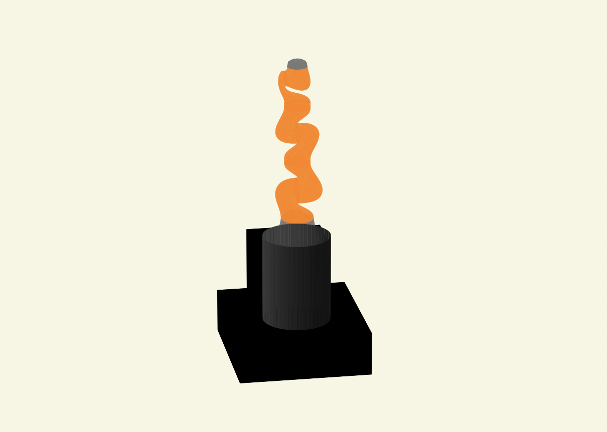
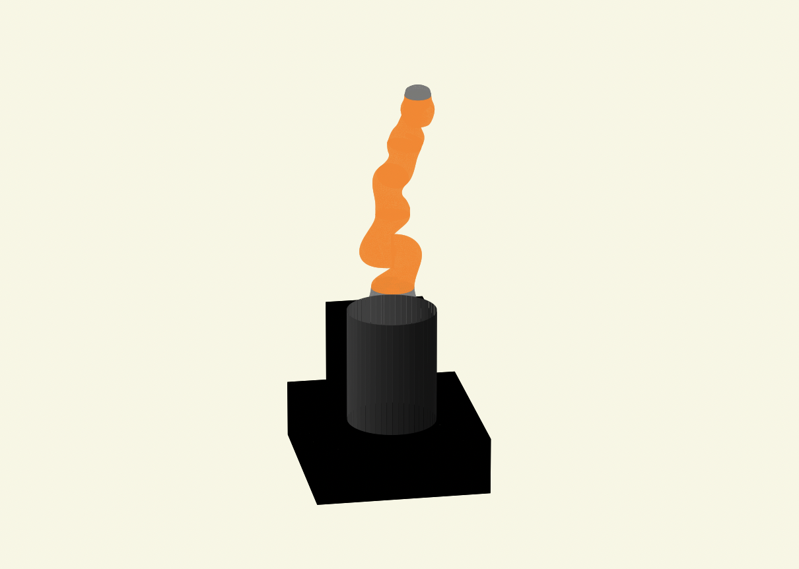

# Sampling based Inverse Kinematics (GaBO IK)

GaBO IK is sampling based inverse kinematics solver using Riemannian geometric aware kernel and Bayesian Optimization

This work is inspired from [Geometry-aware Bayesian Optimization with Riemannian Matérn kernels](https://openreview.net/forum?id=ovRdr3FOIIm)

## Key Features

- Completely gradient-free IK solver
- Using pytorch framework to use optimization tool

## Requirements and Installation

GaBO IK needs additional packages
- torch
- gpytorch
- botorch
- pymanopt
  - latest version does not support several functions, so do not use pypi package

Please install packages via requirements text file
~~~
pip install -r pykin/utils/gabo/requirements.txt
~~~

## Details
GaBO exploits the fact that the robot's joint space constitutes torus, a [Riemannian manifold](https://en.wikipedia.org/wiki/Riemannian_manifold).

To achieve the target pose, GaBO performs [Bayesian optimization](https://arxiv.org/abs/1807.02811) to update Gaussian process models in prior sampled poses.

Since acquisition function in Bayesian optimization is defined in Riemannian metric, Optimizing riemannian manifold is neccesary. So GaBO use [pymanopt](https://pymanopt.org/) package

### Simple execution flow
1. Randomly sample robot's pose which has tendency of target pose
2. Fix joints that are sensitive to changes in values (Base, 1, 2, ...)
3. Find non-fixed joint values using Bayesian optimization to get target pose 

### Pros
- Can aviod robot pose singularity due to gradient-free method

### Cons
- Takes long time due to sampling and manifold (acquisition function) optimization 
- Due to sampling based method, GaBO can not reach optimal target pose, but can reach acceptable target pose

## Examples
- Used iiwa14 model
- Target pose is straight pose which is singular
- 6 dof(position + orientation) pose error = 0.1818
  |                            Target                            |                           GaBO IK                            |
  | :----------------------------------------------------------: | :----------------------------------------------------------: |
  |     |  |

## References
[ [1](https://openreview.net/forum?id=ovRdr3FOIIm) ] N. Jaquier*, V. Borovitskiy*, A. Smolensky, A. Terenin, T. Asfour, and L. Rozo (2021). Geometry-aware Bayesian Optimization in Robotics using Riemannian Matérn Kernels. In Conference on Robot Learning (CoRL).
